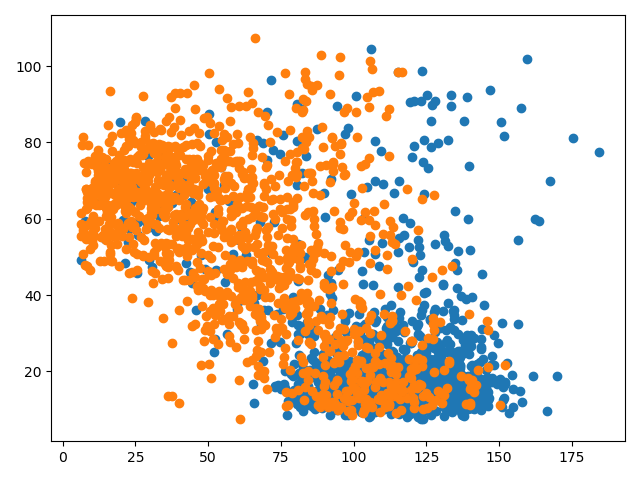
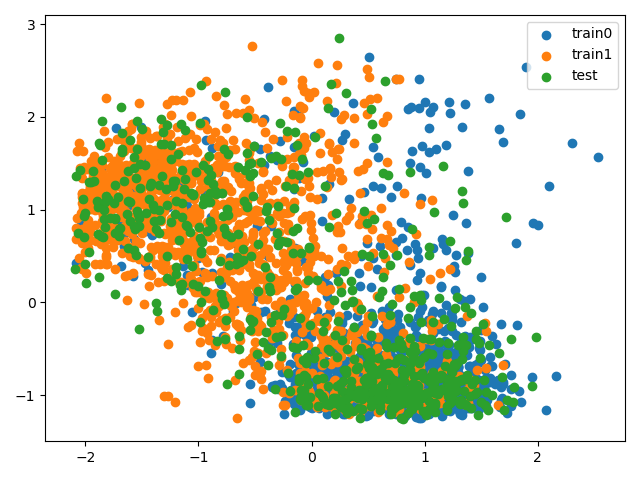

# 2017 级机器学习机器学习框架 kaggle 第一次竞赛实验报告

## 0.1 实验步骤

1.  加载数据，以 .npy 的形式储存并读取
2.  以 0 均值 1 方差的方式处理训练集数据，并得到均值和方差
3.  进行 m 折交叉验证，获得最佳超参数 K 值
4.  构建 KD 树
5.  根据超参数 K 值进行对应的 KNN 模型训练
6.  根据步骤 2 得到的均值和方差对测试集进行处理
7.  对测试集进行预测

## 0.2 函数

1.  `load_data(filename)` -- 加载数据
2.  `data_preprocessing(filename)` –- 保存为 .npy 文件
3.  `get_deal_data(data_set)` – 0 均值 1 方差的均值方差获取
4.  `deal_data(data_set, means, stds)` – 根据 `get_deal_data()` 获得均值和方差对数据进行处理
5.  <s>`def get_data_downD_matrix(data_set, alpha=1.0)`</s>
6.  `KDimensionalNode(object)` -- KD 树结点类，包含的信息：
    *   item -- 结点元素的特征
    *   label -- 结点元素的标签
    *   dim -- 结点所分割的特征下标
    *   parent -- 父结点
    *   left_child -- 左子树
    *   right_child -- 右子树
7.  `KDimensionalTree(object)` – KD 树类
    1.  `__init__(self, point_set)` -- 获取用于构造 KD 树元素的列表下标
    2.  `__create(self, point_set: list, parentNode=None)` – 生成 KD 树
    3.  `length(self)` -- 获得结点数
    4.  `root(self)` -- 获得根节点
    5.  `transfer_list(self, node, kdList=[])` –- 将 KD 树转化为嵌套字典的列表输出
    6.  `_find_nearest_neighbour(self, item)` –- 根据 item 寻找其最近邻
    7.  `knn_algo(self, item, k=1)` –- K 近邻算法
    8.  `left_search(self, item, node, nodeList, k)` – 按左中右顺序遍历子树结点
    9.  `right_search(self, item, node, nodeList, k)` – 按右中左顺序遍历子树结点
8.  `k_cross_validation(kcrosses, hyperparameter)` – K 折交叉验证

## 0.3 实验细节

训练集数据分布：

测试集在训练集中的分布：

从数据集的情况得出，因为存在大量「重叠」数据，逻辑回归并不能很好的分割，会过拟合。

4 折交叉验证的结果：K=16 时正确率最高

*   选择 4 折的原因，测试集训练集的比值约为 0.264，即该取 m=5，但 5 除不尽，故选择 4
*   K 的取值范围为 5~30

